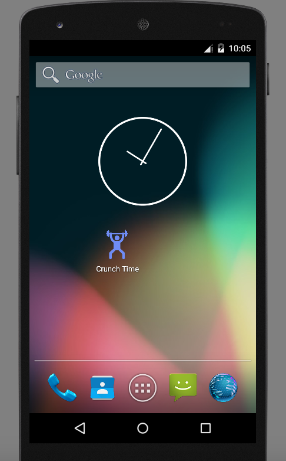
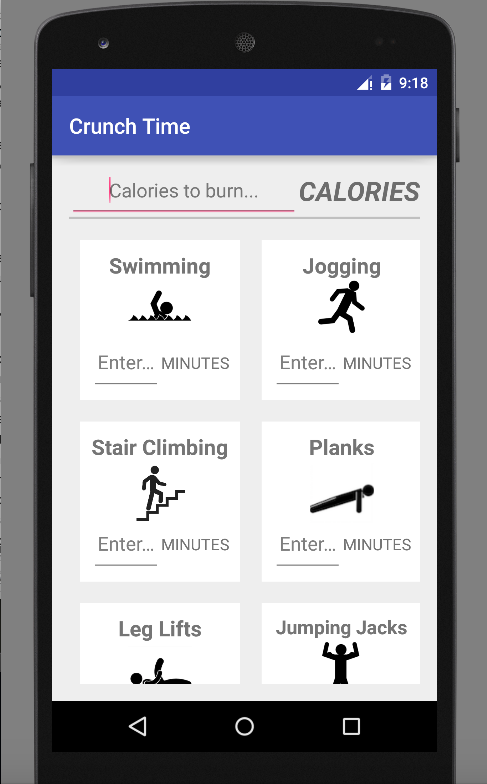
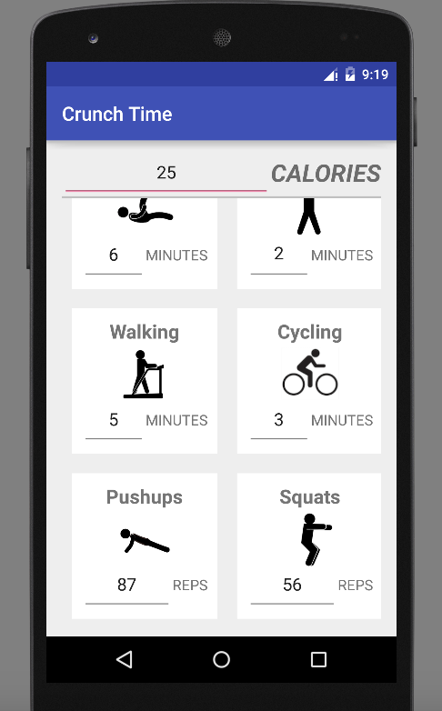

# PROG 01: Crunch Time

The application was designed so that the user can get his or her desired calculations with minimal interaction with the app. The user clicks on the icon for Crunch Time, leading him to the app. At the top of the application, a fixed box with the calories is displayed; while you scroll through the rest of the app, this box stays fixed at the top so the user can easily check the amount of calories for any exercise. The exercises are organized in two columns in card-like white boxes; each has a separate text input to enter in how much of the exercise was done. Each exercise is accompanied by a simple icon so the user can easily locate the exercise while scrolling. As the user inputs the amount that each exercise was done, the number for the calories and for the rest of the exercises changes automatically; if the user deletes the number inside any text input, all the text inputs go back to displaying their default hints. 
## Authors

Akshay Madhani ([akshaymadhani@berkeley.edu](mailto:akshaymadhani@berkeley.edu))

## Demo Video

See [your demo video title here] (https://youtu.be/i7KZ4APE6zY)

## Screenshots

## Acknowledgments

Image credits go to Shutterstock, Clker, Concept Draw, and Pictogram Free. 
